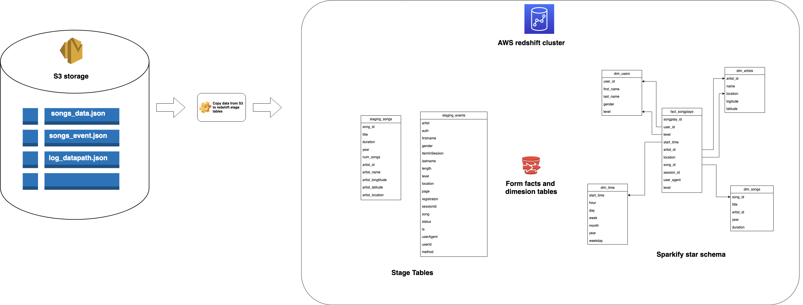

## Project: Sparkify Data Warehouse




## Introduction

Sparkify, a music streaming startup, aims to migrate their data and processes to the cloud. This project involves building an ETL pipeline to extract data from S3, stage it in Redshift, and transform it into a set of dimensional tables for analytical insights.

## Project Description

The project involves developing an ETL pipeline on Amazon Redshift to load data from S3, create staging tables, and transform the data into a star schema optimized for song play analysis. The goal is to enable Sparkify's analytical team to uncover insights about user behavior and music preferences.

## Project Template

The project template includes four files:

1. `create_table.py`: This file is where you'll define your fact and dimension tables for the star schema in Redshift.
2. `etl.py`: In this file, you'll load data from S3 into staging tables on Redshift and then process that data into your analytics tables on Redshift.
3. `sql_queries.py`: Define your SQL statements in this file. These statements will be imported into the two other files mentioned above.
4. `README.md`: This is where you'll provide a discussion on your process and decisions for building the ETL pipeline.

## Project Steps

Below are the steps you can follow to complete each component of this project:

### Create Table Schemas

- **Designing schemas:** Designed schemas for both fact and dimension tables to create an optimized star schema.
- **SQL CREATE statements:** Wrote SQL CREATE statements for each table, defining their structures and relationships in `sql_queries.py`.
- **Completing the logic:** Completed the logic in `create_tables.py` to establish a connection with the database and create the designed tables.
- **SQL DROP statements:** Implemented SQL DROP statements at the beginning of `create_tables.py` to facilitate resetting the database for testing purposes.
- **Launching a Redshift cluster:** Launched a Redshift cluster and created an IAM role with read access to S3 for secure data loading.
- **Adding Redshift configuration:** Added necessary Redshift cluster and IAM role information to `dwh.cfg`.
- **Testing table creation:** Conducted thorough testing by running `create_tables.py` and verifying the created table schemas using the AWS Redshift Query Editor.

### Build ETL Pipeline

- **Implementing data loading:** Implemented the data loading logic in `etl.py`, which extracts data from S3 and stages it in the Redshift staging tables.
- **Transforming to analytics tables:** Further implemented logic in `etl.py` to transform data from staging tables into the analytics tables within the Redshift database.
- **Testing ETL process:** Executed `etl.py` after `create_tables.py` and confirmed the correctness of the ETL pipeline by comparing analytic query results against expected outcomes.
- **Cleaning up resources:** Deleted the Redshift cluster after successfully completing the ETL pipeline and ensuring accurate results from analytics queries.

By following these steps, the ETL pipeline was successfully designed, implemented, and tested to provide insights into Sparkify's user behavior and music trends.


## Project Datasets

The project utilizes three datasets stored in Amazon S3:

- Song data: s3://udacity-dend/song_data
- Log data: s3://udacity-dend/log_data
- Log JSON Path: s3://udacity-dend/log_json_path.json

## Schema for Song Play Analysis

The project's schema consists of both fact and dimension tables:

**Fact Table**

- `songplays`: Records related to song plays
  - songplay_id, start_time, user_id, level, song_id, artist_id, session_id, location, user_agent

**Dimension Tables**

- `users`: Information about app users
  - user_id, first_name, last_name, gender, level
- `songs`: Details about songs
  - song_id, title, artist_id, year, duration
- `artists`: Details about artists
  - artist_id, name, location, latitude, longitude
- `time`: Timestamps of songplays broken down
  - start_time, hour, day, week, month, year, weekday

## Project Setup Checklist

Before starting the project, ensure you have the necessary resources ready:

- Redshift cluster is set up
- IAM role with S3 read access is created
- Database and IAM role information is added to `dwh.cfg`
## Steps to run 

Follow these steps to set up and run the Sparkify data warehouse project:

1. **Create Tables:**
   - Open your terminal.
   - Run the following command to create the necessary tables for the project:
     ```
     $ python create_tables.py
     ```

2. **Load Data:**
   - With the tables created, you can now load and transform the data.
   - Run the following command to execute the ETL process:
     ```
     $ python etl.py
     ```

By following these steps and executing the provided commands, you'll create the required tables, load data from the specified sources, and transform it into analytics tables for insights into Sparkify's user behavior and music trends.
